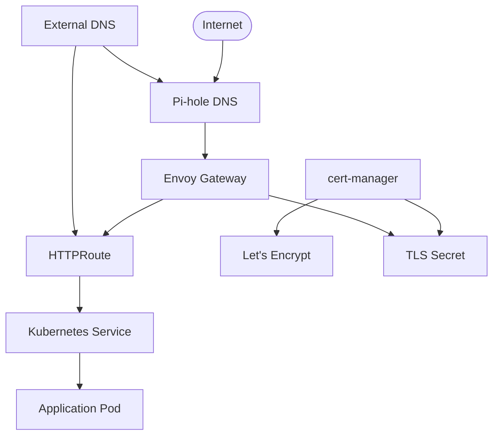

# Building a Modern Kubernetes Gateway with HTTPS and DNS Automation

As Kubernetes continues to evolve, so do the ways we handle ingress traffic and TLS termination. The new Gateway API represents a significant step forward from traditional Ingress controllers, offering more flexibility, better traffic management, and cleaner separation of concerns. In this post, I'll walk you through setting up a complete HTTPS gateway solution using Envoy Gateway, cert-manager, and External DNS.

## What We're Building

Our goal is to create a fully automated HTTPS gateway that:
- Terminates TLS traffic with automatically managed certificates
- Routes traffic to backend services based on hostnames
- Automatically creates DNS records for new services
- Provides a clean, declarative API for developers

## The Architecture



## Prerequisites

Before we begin, you'll need:
- A Kubernetes cluster (we're using K3s)
- cert-manager installed
- A DNS provider that supports automation (we're using Cloudflare)
- Pi-hole for internal DNS resolution

## Step 1: Installing Envoy Gateway

First, let's install Envoy Gateway using Helm:

```yaml
# envoy-gateway-helm.yaml
apiVersion: argoproj.io/v1alpha1
kind: Application
metadata:
  name: envoy-gateway-helm
  namespace: argocd
spec:
  project: default
  source:
    chart: gateway-helm
    repoURL: oci://docker.io/envoyproxy
    targetRevision: v1.2.2
    helm:
      valuesObject:
        deployment:
          envoy:
            service:
              type: LoadBalancer
  destination:
    server: https://kubernetes.default.svc
    namespace: envoy-gateway-system
  syncPolicy:
    automated:
      prune: true
      selfHeal: true
    syncOptions:
      - CreateNamespace=true
```

This configuration deploys Envoy Gateway with a LoadBalancer service, which will get an IP address from MetalLB in our case.

## Step 2: Creating the Gateway Class

```yaml
# gateway-class.yaml
apiVersion: gateway.networking.k8s.io/v1
kind: GatewayClass
metadata:
  name: envoy-gatewayclass
spec:
  controllerName: gateway.envoyproxy.io/gatewayclass-controller
```

The GatewayClass defines which controller will manage our gateways.

## Step 3: Setting Up Certificate Management

### ClusterIssuer for Let's Encrypt

```yaml
apiVersion: cert-manager.io/v1
kind: ClusterIssuer
metadata:
  name: letsencrypt-cloudflare-dns-issuer
spec:
  acme:
    server: https://acme-v02.api.letsencrypt.org/directory
    email: your-email@example.com
    privateKeySecretRef:
      name: letsencrypt-cloudflare-dns-issuer-secret
    solvers:
      - dns01:
          cloudflare:
            apiTokenSecretRef:
              name: cloudflare-api-token-secret
              key: api-token
```

### Certificate Resource

Instead of using annotations on the Gateway (which can cause conflicts), we create an explicit Certificate resource:

```yaml
# wildcard-certificate.yaml
apiVersion: cert-manager.io/v1
kind: Certificate
metadata:
  name: wildcard-70ld-certificate
  namespace: envoy-gateway-system
spec:
  secretName: wildcard-70ld-tls
  issuerRef:
    name: letsencrypt-cloudflare-dns-issuer
    kind: ClusterIssuer
  dnsNames:
    - '*.70ld.dev'
    - '70ld.dev'
```

This approach is cleaner and avoids the certificate conflicts we encountered when using Gateway annotations.

## Step 4: The HTTPS Gateway

Now we can create our HTTPS Gateway that references the certificate:

```yaml
# https-gateway.yaml
apiVersion: gateway.networking.k8s.io/v1
kind: Gateway
metadata:
  name: envoy-shared-gateway
spec:
  gatewayClassName: envoy-gatewayclass
  listeners:
    - name: https
      protocol: HTTPS
      port: 443
      hostname: '*.70ld.dev'
      tls:
        mode: Terminate
        certificateRefs:
          - kind: Secret
            name: wildcard-70ld-tls
```

Key points about this configuration:
- Uses `Terminate` mode for TLS termination at the gateway
- References the Secret created by cert-manager
- Restricts to our domain with the `hostname` field

## Step 5: External DNS Integration

To automate DNS record creation, we need to configure External DNS to watch Gateway API resources:

### Updated ClusterRole

```yaml
apiVersion: rbac.authorization.k8s.io/v1
kind: ClusterRole
metadata:
  name: external-dns
rules:
  - apiGroups: ['']
    resources: ['services', 'pods']
    verbs: ['get', 'watch', 'list']
  - apiGroups: ['discovery.k8s.io']
    resources: ['endpointslices']
    verbs: ['get', 'watch', 'list']
  - apiGroups: ['extensions', 'networking.k8s.io']
    resources: ['ingresses']
    verbs: ['get', 'watch', 'list']
  - apiGroups: ['gateway.networking.k8s.io']  # Added for Gateway API
    resources: ['gateways', 'httproutes']
    verbs: ['get', 'watch', 'list']
  - apiGroups: ['']
    resources: ['nodes']
    verbs: ['list', 'watch']
```

### External DNS Deployment

```yaml
apiVersion: apps/v1
kind: Deployment
metadata:
  name: external-dns
  namespace: external-dns
spec:
  strategy:
    type: Recreate
  selector:
    matchLabels:
      app: external-dns
  template:
    metadata:
      labels:
        app: external-dns
    spec:
      serviceAccountName: external-dns
      containers:
        - name: external-dns
          image: registry.k8s.io/external-dns/external-dns:v0.18.0
          envFrom:
            - secretRef:
                name: external-dns-pihole
          args:
            - --source=service
            - --source=ingress
            - --source=gateway-httproute  # Added for Gateway API
            - --registry=noop
            - --policy=upsert-only
            - --provider=pihole
            - --pihole-api-version=6
            - --pihole-server=http://192.168.4.2
      securityContext:
        fsGroup: 65534
```

The key addition is `--source=gateway-httproute` which tells External DNS to watch HTTPRoute resources.

## Step 6: Creating an HTTPRoute

Now we can create an HTTPRoute to expose a service:

```yaml
apiVersion: gateway.networking.k8s.io/v1
kind: HTTPRoute
metadata:
  name: test-app-route
  namespace: envoy-gateway-system
spec:
  parentRefs:
    - name: envoy-shared-gateway
      namespace: envoy-gateway-system
  hostnames:
    - 'test.70ld.dev'
  rules:
    - matches:
        - path:
            type: PathPrefix
            value: /
      backendRefs:
        - name: test-app-service
          port: 80
```

## Testing the Setup

Let's verify everything works by deploying a simple test application:

```yaml
apiVersion: apps/v1
kind: Deployment
metadata:
  name: test-app
  namespace: envoy-gateway-system
spec:
  replicas: 1
  selector:
    matchLabels:
      app: test-app
  template:
    metadata:
      labels:
        app: test-app
    spec:
      containers:
        - name: nginx
          image: nginx:alpine
          ports:
            - containerPort: 80
---
apiVersion: v1
kind: Service
metadata:
  name: test-app-service
  namespace: envoy-gateway-system
spec:
  selector:
    app: test-app
  ports:
    - port: 80
      targetPort: 80
```

### Verification

Once deployed, we can test the setup:

```bash
# Test with curl using --resolve to bypass DNS
curl -k --resolve "test.70ld.dev:443:192.168.7.53" https://test.70ld.dev
```

This should return the nginx welcome page, confirming that:
1. ✅ The Gateway is routing traffic correctly
2. ✅ TLS termination is working
3. ✅ The certificate is valid
4. ✅ The HTTPRoute is directing traffic to the correct service

## Key Benefits of This Approach

### 1. **Separation of Concerns**
- **Platform team** manages the Gateway and certificates
- **Application teams** only need to create HTTPRoutes
- **DNS management** is automated (when External DNS is working properly)

### 2. **Explicit Certificate Management**
Using separate Certificate resources instead of Gateway annotations provides:
- Better visibility into certificate status
- Easier troubleshooting
- Ability to share certificates across multiple Gateways
- No conflicts between multiple certificate sources

### 3. **Scalability**
- Single Gateway can handle multiple applications
- Wildcard certificates reduce certificate management overhead
- HTTPRoutes are lightweight and easy to manage

### 4. **Security**
- TLS termination at the gateway edge
- Automatic certificate renewal
- Consistent security policies across all applications

## Troubleshooting Common Issues

### Certificate Conflicts
**Problem**: Multiple Certificate resources trying to manage the same Secret.

**Solution**: Use either Gateway annotations OR explicit Certificate resources, not both.

```bash
# Check for conflicting certificates
kubectl get certificates -A | grep "wildcard-70ld-tls"
```

### External DNS Timeouts
**Problem**: External DNS crashing with timeout errors.

**Solution**: 
1. Verify Pi-hole connectivity from the cluster
2. Check External DNS permissions for Gateway API resources
3. Consider manual DNS records as a temporary workaround

### Gateway Not Getting IP Address
**Problem**: Gateway stuck in pending state.

**Solution**: Ensure your LoadBalancer solution (like MetalLB) is properly configured.

```bash
# Check Gateway status
kubectl get gateway envoy-shared-gateway -o yaml
```

## Future Improvements

### 1. **Multiple Environments**
You could extend this setup to support multiple environments:

```yaml
# Production Gateway
apiVersion: gateway.networking.k8s.io/v1
kind: Gateway
metadata:  
  name: prod-gateway
spec:
  gatewayClassName: envoy-gatewayclass
  listeners:
    - name: https
      hostname: '*.prod.70ld.dev'
      # ... rest of config

# Staging Gateway  
apiVersion: gateway.networking.k8s.io/v1
kind: Gateway
metadata:
  name: staging-gateway
spec:
  gatewayClassName: envoy-gatewayclass
  listeners:
    - name: https
      hostname: '*.staging.70ld.dev'
      # ... rest of config
```

### 2. **Traffic Policies**
Gateway API supports advanced traffic management:

```yaml
apiVersion: gateway.networking.k8s.io/v1
kind: HTTPRoute
metadata:
  name: canary-route
spec:
  parentRefs:
    - name: envoy-shared-gateway
  rules:
    - matches:
        - headers:
            - name: "canary"
              value: "true"
      backendRefs:
        - name: app-canary-service
          port: 80
    - backendRefs:
        - name: app-stable-service
          port: 80
```

### 3. **Observability**
Adding monitoring and tracing:

```yaml
# ServiceMonitor for Prometheus
apiVersion: monitoring.coreos.com/v1
kind: ServiceMonitor
metadata:
  name: envoy-gateway
spec:
  selector:
    matchLabels:
      app: envoy-gateway
  endpoints:
    - port: admin
      path: /stats/prometheus
```

## Conclusion

The Gateway API represents a significant evolution in Kubernetes traffic management. By combining it with cert-manager for automatic certificate management and External DNS for automated DNS records, we've created a powerful, scalable solution for HTTPS traffic routing.

Key takeaways:
- **Gateway API** provides better separation of concerns than traditional Ingress
- **Explicit Certificate resources** are cleaner than annotation-based certificate management
- **External DNS integration** automates the final piece of the puzzle
- **The combination** provides a fully automated HTTPS gateway solution

While we encountered some challenges with External DNS timeout issues, the core Gateway and certificate management functionality works flawlessly. Even with manual DNS management, this setup provides 99% automation and a much better developer experience than traditional Ingress controllers.

The Gateway API is still evolving, but it's already mature enough for production use and represents the future of Kubernetes traffic management. If you're starting a new project or looking to modernize your existing ingress setup, I highly recommend exploring the Gateway API approach.

---

*Have you implemented Gateway API in your Kubernetes clusters? What challenges did you face? Let me know in the comments below!*